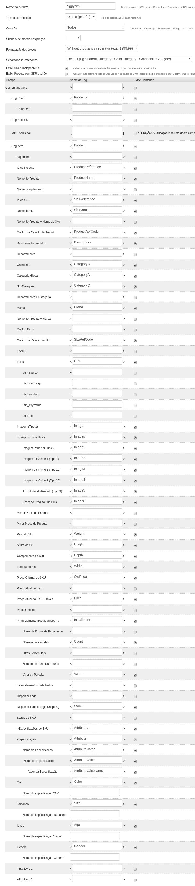

# VTEX Search

The VTEX Search is an app that handles the result of our Search and Engagement API, used to provide
a more complete search experience.

:loudspeaker: **Disclaimer:** Don't fork this project; use, contribute, or open issue with your feature request.

### store.search.new

Add the `store.search.new` block to your `blocks.json`, like:

```json
"store.search.new": {
  "blocks": ["search-result"]
}
```

This will provide your store with a new route `/search` that will handle all search navigation
from now on, but first you need to redirect the `search-bar` requests to this new route, using
the `customPageUrl` prop on the `search-bar` component.

```json
"search-bar": {
  "props": {
    "customSearchPageUrl": "/search?query=${term}"
  }
}
```

We don't yet support some of the ordering options that are supported by the current search implementation,
so they should be hidden so that it doesn't confuse your costumers. You can hide ordering options by
passing them to the `hiddenOptions` prop on the `order-by` component.

```json
"order-by": {
  "props": {
    "hiddenOptions": [
      "OrderByReleaseDateDESC",
      "OrderByNameASC",
      "OrderByNameDESC"
    ]
  }
}
```

### XML Integration indexing

At the moment, the only way to index the products of the store into this new search experience is
by creating a XML document that contains the entire catalog.

This can be accomplished by using the `Catalog > XML Integration` page in the admin.

Create a new XML following closely to the image below:



We're working on closely integrating into the VTEX Catalog, so that this step may be bypassed in
the future!
